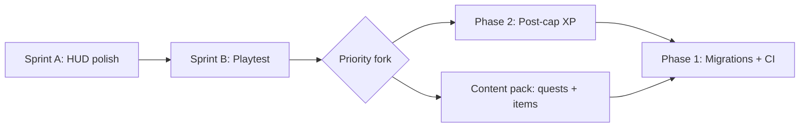

# Wardenfall — Direction Plan (Q3 2026)

This is the **near-term** plan: what we just shipped, what comes next, and how it maps to the
multi-year track in [`roadmap.md`](roadmap.md).

---

## Recently completed (HUD / feel)

| Item | Status |
|------|--------|
| Smooth diagonal movement + camera look | Done |
| Window stacking + single Esc closes all | Done |
| Compact micro-menu (WoW-style) | Done |
| Talents panel redesign (Apply / builds / sidebar) | Done |
| Timing bar: cast + swing timer, anchored above action bar | Done |

---

## Current focus — **Player-facing polish**

Goal: the game *feels* like a classic MMO before we widen content.

### Sprint A (1 week) — HUD polish ✅

1. Talents spec tab + target frame auras + boss/elite styling
2. Window stacking via `openHudWindow` / `closeHudWindow`
3. Unit tests for swing timer helpers

### Sprint B (1–2 weeks) — Playtest loop ✅

1. Level 1→5 warrior + mage smoke paths (offline). HUD checks in `smoke_browser.mjs`.
2. Dev default port **5176** (5173 often occupied locally). Override with `VITE_PORT` / `GAME_URL`.
3. Pre-release checklist:
   - `npm run smoke:warrior` — movement, combat, loot, quest, HUD stack/Esc/swing timer
   - `npm run smoke:mage` — casting, polymorph, conjure water
   - `npm test`

---

## Current focus — **Track 2: Content breadth** (started)

Goal: more classic-MMO feel via data-as-code in `src/sim/content/` — low architecture risk.

### Content slice 1 ✅

1. **Explore quests** — one scout quest per zone (Eastbrook, Mirefen, Thornpeak).
2. **Item sets** — Wolf Runner (Eastbrook quest line) + Fenwalker (Mirefen vendor).
3. Fourth zone band or dungeon depth (later slice).

### Content slice 2 (started)

- **Cragwalker set** ✅ — Thornpeak vendor set (Stalkerhide Jerkin, Windguard Leggings, Cragwalker Boots at Quartermaster Bree).
- Escort / talk-chain quests ✅
- Dungeon depth (later)

### Graphics slice G1 ✅ (enemy readability)

1. **MOB_KEYS** — zone/dungeon mobs map to role-specific rigs (skeleton warriors, casters, bruisers) instead of generic family fallbacks.
2. **Elite/rare/boss mods** — render-only scale + tint boost via `mobVisualMods()` (sim `scale` unchanged).
3. **Combat shadows** — articulated shadow range 25→32 yd so nearby enemies keep grounding.

### Graphics slice G2 (next)

- Terrain material / biome contrast pass

### Graphics slice G3 (later)

- Foliage density and LOD tuning

### Track 1 — **Endgame at 20** ✅ (Phase 2 shipped)

Lifetime XP overflow, virtual levels, prestige, milestones, and `/api/leaderboard` are in `main`.
See `tests/xp.test.ts` and `docs/prd/max-level-xp-overflow.md`.

---

## Next major tracks (after content slice 1)

- More quests per zone (escort, explore — not only kill/collect)
- Item sets + remaining armor slots
- Fourth zone band or dungeon depth

*Why now:* biggest gap vs. classic MMO feel; low architecture risk (data-as-code in `src/sim/content/`).

### Track 3 — **Systems depth**

- Professions / crafting (gather → craft → economy hook)
- Spell ranks (design: [`docs/design/spell-ranks.md`](design/spell-ranks.md))
- LFG / dungeon finder polish

### Track 4 — **Live ops & scale** (roadmap Phase 1)

- DB migrations (`server/migrations/`)
- Instance manager generalization
- CI: visual tour + MP integration on every merge
- Local dev: Docker Postgres documented for Windows

*Why defer slightly:* polish and content improve the game players see today; infra pays off when running multiple realms in prod.

---

## Recommended sequence

**Default recommendation:** finish **Sprint A → Sprint B**, then **Phase 2 post-cap progression** (high retention, PRD exists), then **content pack**, then **Phase 1 infra**.

---

## Definition of done (every slice)

- `npx tsc --noEmit` clean
- `npm test` green (add tests for sim/HUD behavior changes)
- Full i18n for new player-visible strings
- Mobile + `?lowgfx` still playable
- Conventional commit with scope

---

## Open decisions (for you)

1. **Post-cap first vs. content first** after HUD polish?
2. **Online dev on Windows** — invest in Docker Desktop guide vs. cloud dev DB?
3. **Graphics track** ([`docs/design/graphics-plan.md`](design/graphics-plan.md)) — stay deferred or parallel low-cost wins (mipmaps, code-splitting)?

---

*Last updated: June 2026 — adjust after each merged slice.*
