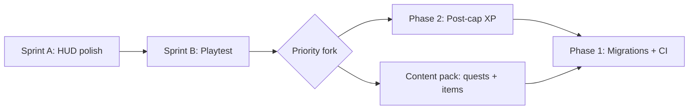

# Wardenfall — Direction Plan (Q3 2026)

This is the **near-term** plan: what we just shipped, what comes next, and how it maps to the
multi-year track in [`roadmap.md`](roadmap.md).

---

## Recently completed (HUD / feel)

| Item | Status |
|------|--------|
| Smooth diagonal movement + camera look | Done |
| Window stacking + single Esc closes all | Done |
| Compact micro-menu (WoW-style) | Done |
| Talents panel redesign (Apply / builds / sidebar) | Done |
| Timing bar: cast + swing timer, anchored above action bar | Done |

---

## Current focus — **Player-facing polish**

Goal: the game *feels* like a classic MMO before we widen content.

  docs/plan-direction.md

### Sprint B (1–2 weeks) — Playtest loop

1. Level 1→5 warrior + mage smoke paths (offline + online when Docker/Postgres available).
2. Fix friction from playtest (tooltip gaps, mobile touch targets, i18n drift).
3. Wire `scripts/smoke_warrior.mjs` / `smoke_mage.mjs` into a quick pre-release checklist.

---

## Next major tracks (pick order after polish)

### Track 1 — **Endgame at 20** (roadmap Phase 2)

PRD: [`docs/prd/max-level-xp-overflow.md`](prd/max-level-xp-overflow.md)

- Virtual levels + prestige ranks with real rewards
- Leaderboards API + in-game board
- XP bar overflow styling (partially stubbed in `xp_bar.ts`)

*Why now:* engine is ready; gives level-20 players a reason to stay.

### Track 2 — **Content breadth**

- More quests per zone (escort, explore — not only kill/collect)
- Item sets + remaining armor slots
- Fourth zone band or dungeon depth

*Why now:* biggest gap vs. classic MMO feel; low architecture risk (data-as-code in `src/sim/content/`).

### Track 3 — **Systems depth**

- Professions / crafting (gather → craft → economy hook)
- Spell ranks (design: [`docs/design/spell-ranks.md`](design/spell-ranks.md))
- LFG / dungeon finder polish

### Track 4 — **Live ops & scale** (roadmap Phase 1)

- DB migrations (`server/migrations/`)
- Instance manager generalization
- CI: visual tour + MP integration on every merge
- Local dev: Docker Postgres documented for Windows

*Why defer slightly:* polish and content improve the game players see today; infra pays off when running multiple realms in prod.

---

## Recommended sequence

**Default recommendation:** finish **Sprint A → Sprint B**, then **Phase 2 post-cap progression** (high retention, PRD exists), then **content pack**, then **Phase 1 infra**.

---

## Definition of done (every slice)

- `npx tsc --noEmit` clean
- `npm test` green (add tests for sim/HUD behavior changes)
- Full i18n for new player-visible strings
- Mobile + `?lowgfx` still playable
- Conventional commit with scope

---

## Open decisions (for you)

1. **Post-cap first vs. content first** after HUD polish?
2. **Online dev on Windows** — invest in Docker Desktop guide vs. cloud dev DB?
3. **Graphics track** ([`docs/design/graphics-plan.md`](design/graphics-plan.md)) — stay deferred or parallel low-cost wins (mipmaps, code-splitting)?

---

*Last updated: June 2026 — adjust after each merged slice.*
